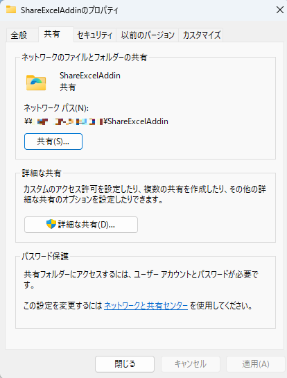

# EXCEL カスタム関数でAI実行デモ

デモ用に作成した EXCEL カスタム関数です。  
本番環境のご利用はお控えください。  
APIKey 等シークレット情報の取り扱いにはご注意ください。

ローカルで実行したい場合、`manifest.xml` 内の URL を `https://localhost:3000` に変更してください。  
`manifest.xml` 内で指定している静的サイトは予告なく閉鎖されることがあります。  
自身でデプロイしたい場合は、[こちら](https://learn.microsoft.com/ja-jp/office/dev/add-ins/publish/publish-add-in-vs-code)を参考にしてください。

カスタマイズを行いたい場合は、[こちら](https://learn.microsoft.com/ja-jp/office/dev/add-ins/tutorials/excel-tutorial-create-custom-functions?tabs=excel-windows)を参考にセットアップし、本リポジトリの `/src` 配下を上書きすることで可能です（2024年12月時点）。

## 免責事項

本ソフトウェアの使用により生じたいかなる損害についても、作者は一切の責任を負いません。自己責任でご利用ください。

## 前提条件

- Azure Open AI のエンドポイント、APIKey は自身で用意してください。
- Windows デスクトップ版 EXCEL でのみ動作確認しております。

## Excel Custom Function Setup Guide

### Step 1: Save and Share the Manifest
`manifest.xml` を適当なフォルダに保存し、そのフォルダを共有する。  

### Step 2: Obtain the Network Path
共有したフォルダのネットワークパスを取得する  
例 `\\DESKTOP-XXXXXX\ExcelCustomFunction`

### Step 3: Open Excel Options
EXCEL を起動し、オプションを選択する。  

### Step 4: Open Trust Center Settings
トラストセンターを選択し、トラストセンターの設定を開く。  

### Step 5: Add Trusted Add-in Catalog
信頼できるアドインカタログを選択し、カタログの URL に共有したフォルダのネットワークパスを入力する。カタログの追加を押下し、[メニューに表示する] チェック ボックスをオンにして、OK を押下する。  

### Step 6: Restart Excel and Add the Add-in
EXCEL を再起動し、アドイン - その他のアドイン を押下する。  

### Step 7: Select and Add the Shared Folder Add-in
共有フォルダタブを選択し、共有フォルダのアドインを選択し、追加を押下する。  

### Step 8: Handle Security Message
下記のようなメッセージが表示された場合、キャンセルを押下する。  

### Step 9: Configure the Task Pane
Show Task Pane を押下し、自身で用意した Azure Open AI の endpoint, apiversion, model, apikey を入力する。  
例  
endpoint: `https://YOUR_RESOURCE_NAME.openai.azure.com/`  
apiversion: `2024-05-01-preview`  
model: `gpt-4o` ※デプロイ名です。モデル名ではありません。  

### Step 10: Use the AOAI.AI Function
AOAI.AI 関数を使用することができる。  
例 `=AOAI.AI("Hello")`  

### Step 11: Remove the Sideloaded Add-in
利用終了後、サイドロードされたアドインを削除する場合はこちらを参考にしてください。  
[こちら](https://learn.microsoft.com/ja-jp/office/dev/add-ins/testing/create-a-network-shared-folder-catalog-for-task-pane-and-content-add-ins#remove-a-sideloaded-add-in)を参考にしてください。

## Reference

- [Create a Network Shared Folder Catalog](https://learn.microsoft.com/ja-jp/office/dev/add-ins/testing/create-a-network-shared-folder-catalog-for-task-pane-and-content-add-ins#share-a-folder)
- [Excel Custom Functions Tutorial](https://learn.microsoft.com/ja-jp/office/dev/add-ins/tutorials/excel-tutorial-create-custom-functions?tabs=excel-windows)
- [Publish Add-in with VS Code](https://learn.microsoft.com/ja-jp/office/dev/add-ins/publish/publish-add-in-vs-code)